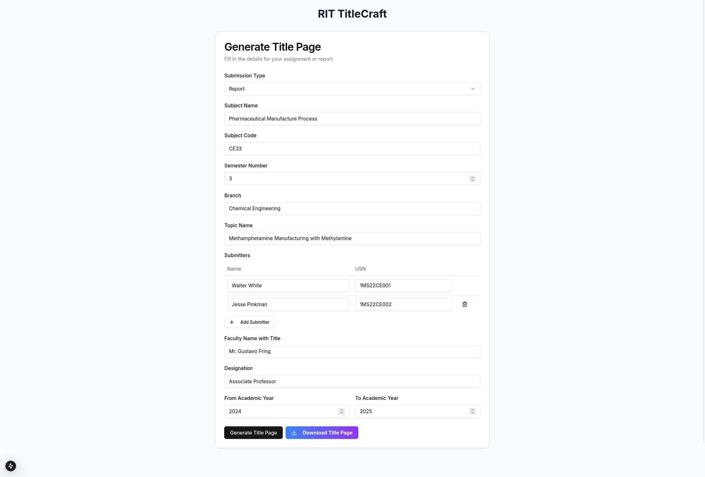
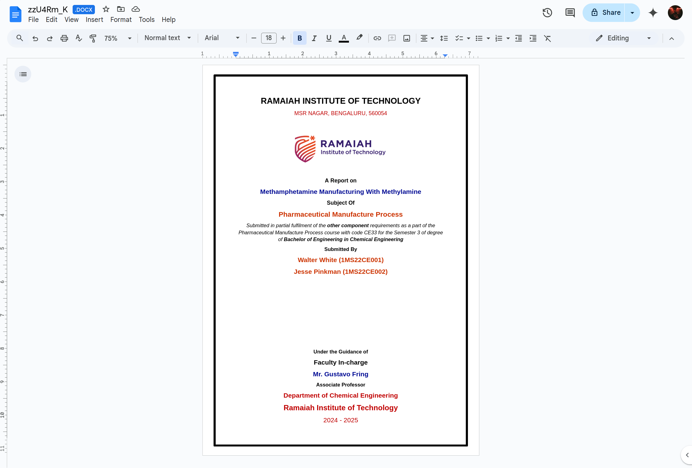

# rit-titlepage

A title-page maker for project reports required for projects and assignments in Ramaiah Institute of Technology.

## Instructions for use

The following information has to be entered:

1. Submission type (Report or Assignment).
2. Name of the Subject in full.
3. Subject code.
4. Branch/Department name in full.
5. Topic name in full.
6. Names and USNs of the submitters.
7. Name of the Faculty member concerned (with title e. g. Mr., Dr. etc)
8. Designation of the Faculty member concerned.
9. Start year and End year of the current academic year.

Then, click on "Generate Title Page". After this, a handy "Download Title Page" button will appear, on clicking which you will be downloading the title page in docx format.

The result would look something like:

